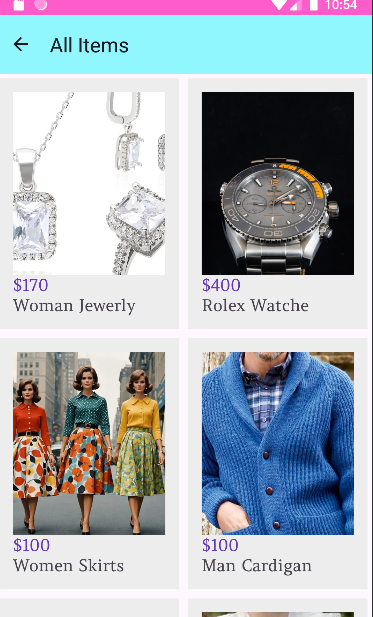

#  E-Commerce Android App

A modern and minimalistic **e-commerce mobile application** built with Android Studio.  
It offers a smooth user experience with onboarding screens, Firebase-based authentication, product listings, and a functional shopping cart.

---

## Key Features

###  Onboarding Experience
- 3 beautifully designed screens introducing the app's benefits
- Highlights: **Fast Delivery**, **Secure Service**, and **Simple Shopping**
- Intuitive navigation with a **Start** button to begin

###  Firebase Authentication
- **Sign Up** with Name, Email & Password
- **Login** with Email & Password
- Powered by **Firebase Authentication**

###  Home Page (`HomeFragment`)
- Clean toolbar with shopping cart access
- Auto-sliding **promo banner**
- Three horizontal carousels:
  -  Categories
  -  Popular Products
  -  New Arrivals

###  Product Details
- Full-screen product view with:
  - Description
  - **Buy Now** and **Add to Cart** options

### 🛒 Shopping Cart
- View added products in the cart
- Supports multiple quantities
- Real-time **total price calculation**

---

##  Tech Stack

-  **Java**
-  **Android Studio**
-  **Firebase Authentication**
-  **Firebase Cloud Firestore**

---

##  App Screenshots

| Onboarding 1 | Onboarding 2 | Onboarding 3 |
|:------------:|:------------:|:------------:|
|  |  |  |

| Sign Up | Home | Product |
|:-------:|:----:|:-------:|
|  |  |  |

| All Items | Add to Cart |
|:----------:|:------------:|
|  |  |

---

##  About the Project

This project was developed as part of a **mobile app development course**, focusing on clean architecture, Firebase integration, and a real-world shopping experience.  
It can be expanded with features like payment integration, order history, and user profiles.

---

